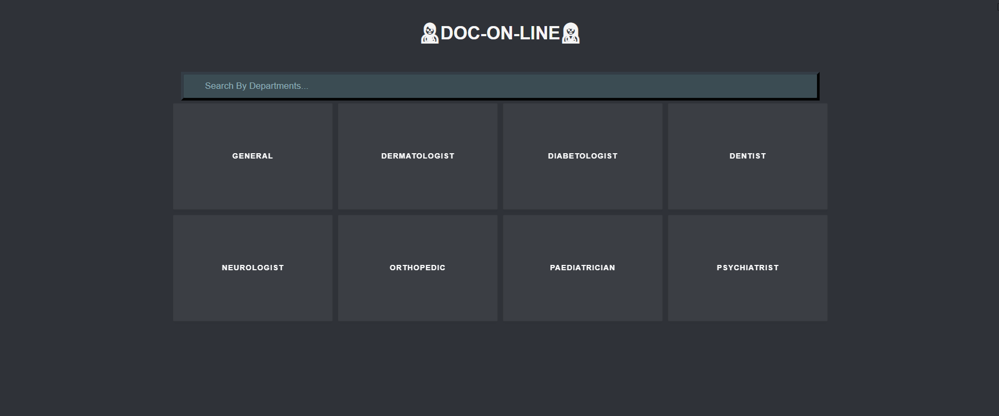

# Doc-On-Line 
  * Doc-On-Line is a project that connects people with Doctor's, The post Pandemic is still a pandemic. so we just need some change in approaching certain things in life thats why I created this project.

# Future for Doc-On-Line
  * This projects is a simple Web 1.0 app that used {a} tag to provide data.
  * In future, UI/UX will be improved, Api calls will be integrated for vast variety amount of data, User Registration and sign in will be created, and integrated chatting system.
# Stack Used :
  * Html
  * Css
  * Javascript
# Screenshots of the project ⬇️

# Live demo :
  * link - https://doc-on-line.netlify.app/home.html
